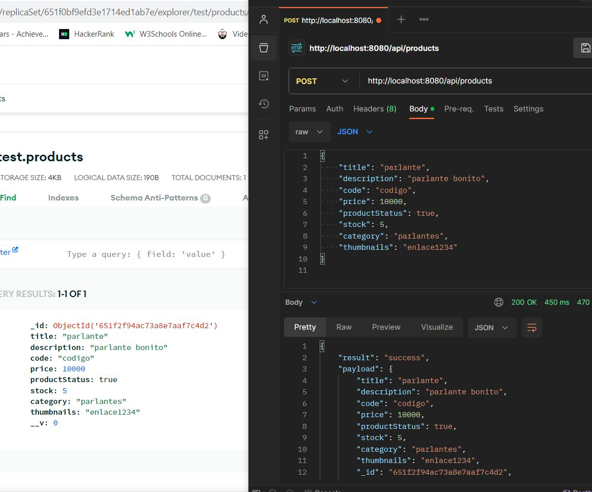
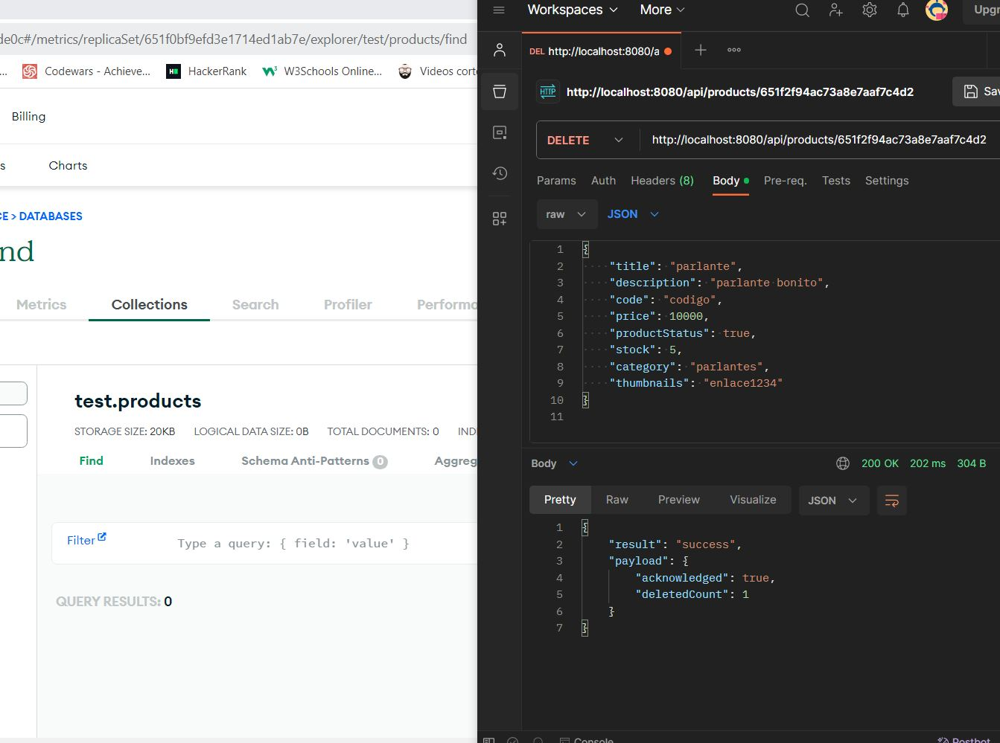
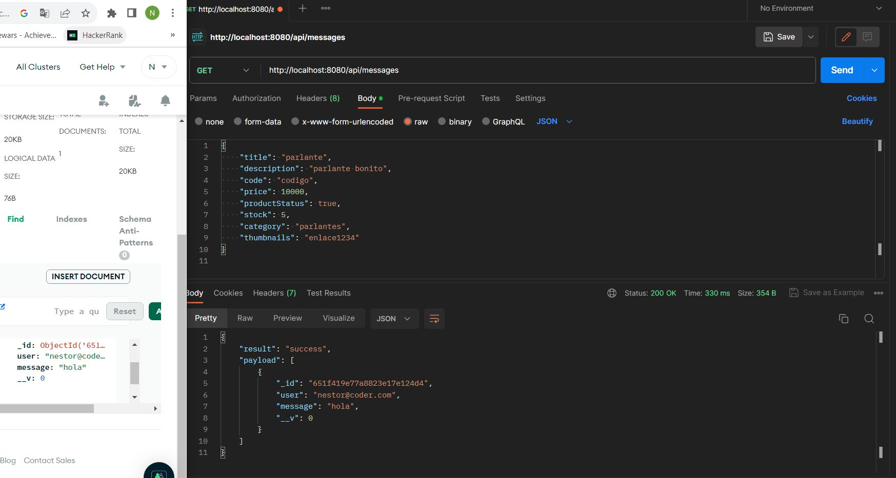

# Proyecto integrador

El proyecto consiste en configurar las solicitudes con postman dirigidas a un servidor MongoAtlas.

Las rutas permiten trabajar con:
1. CRUD de productos.
2. CRUD de carrito, si bien no se especificó ningun tipo de lógica para éstos, se pueden creat carritos vacíos con POST, y editar sus productos con PUT, se entiende que quizá no es la lógica para la configuración del carrito, sin embargo las solicitudes funcionan sin problemas.

3. Envío de mensajes con formulario usando handlebars.

Algunas imágenes mostrando el funcionamiento:

POST PRODUCT

DELETE PRODUCT

GET MESSAGES

